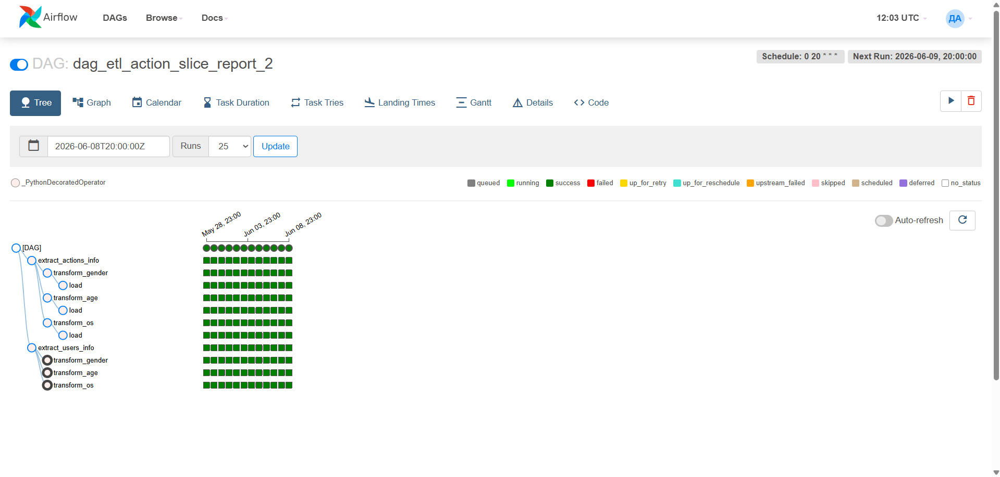
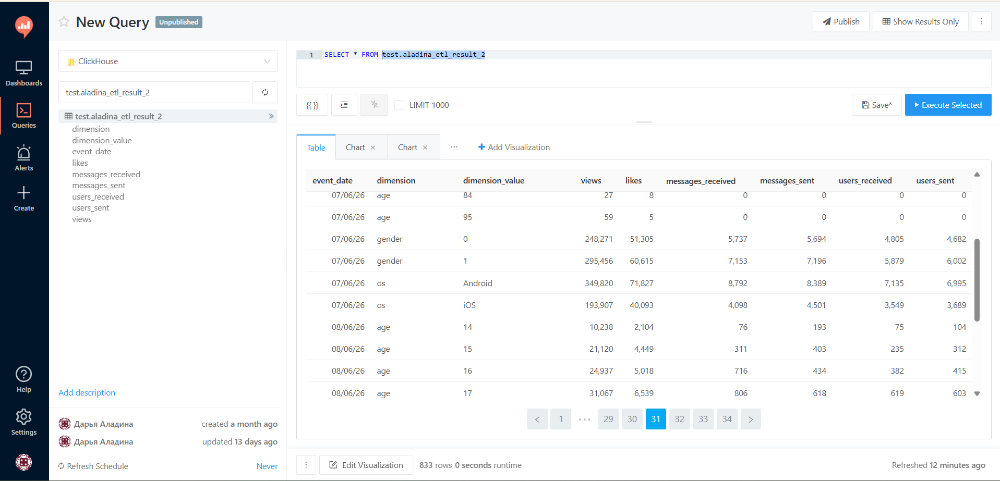
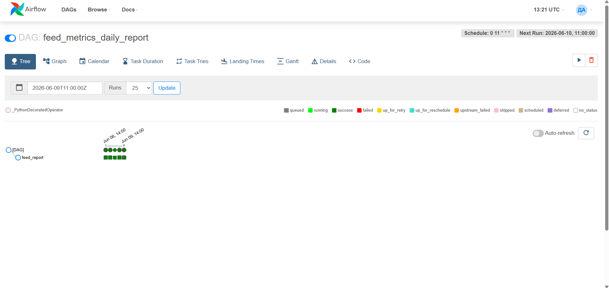
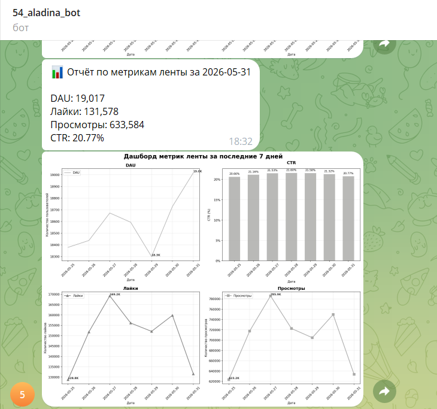
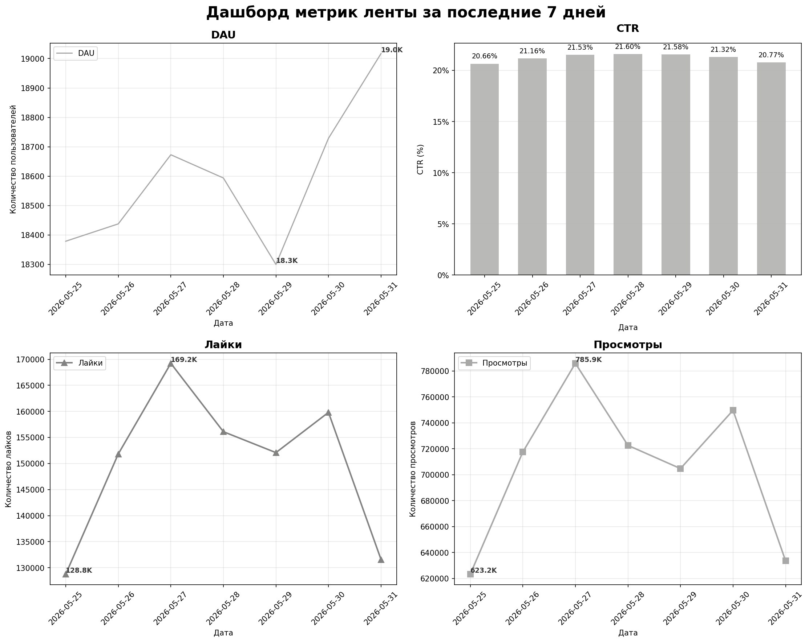

# Apache-Airflow-projects

<h2>Построение <a href="https://github.com/daria-aladina/Apache-Airflow-projects/blob/main/etl_task_report.py" target="_blank">ETL-пайплайна</a></h2>

Задача: Создать DAG в Airflow с ETL-пайплайном, который будет считаться каждый день за вчера.   Требования к пайплайну:

  <ol>
    <li>Необходимо параллельно обрабатывать две таблицы. В feed_actions для каждого юзера считать: число просмотров и лайков контента. В message_actions для каждого юзера считать: количество отправленных сообщений, количество                   отправленных   сообщений, скольким людям он пишет, сколько людей пишет ему. Каждую выгрузку необходимо делать отдельным таском.</li>
    <li>Объединить две полученные таблицы в одну.</li>
    <li>Для получившейся общей таблицы необходимо посчитать все эти метрики в разрезе по полу, возрасту и ос. Рассчёт метрик по каждому срезу должен быть в отдельном таске.</li>
    <li>Финальные данные со всеми метриками записывать в отдельную таблицу в ClickHouse.</li>
    <li>Каждый день таблица должна наполняться новыми данными.</li>
  </ol>

<bold>Стек:</bold> ClickHouse, Python (pandas, pandahouse, airflow.decorators), Redash, Apache Airflow, Git

<a href="https://github.com/daria-aladina/Apache-Airflow-projects/blob/main/etl_task_report.py" target="_blank">Код решения задачи</a>
 
 

 

   <b>
     Демонстрация результата работы DAG с ETL-пайплайном (Airflow + Redash)
   </b>
 

  

     
      <code>Список запущенных дагов</code>   
     
      <code>Демонстрация графа и статусов тасков</code>   
     
      <code>Результирующая таблица с данными за несколько дней</code>   
  

<h2>Автоматизированный <a href="https://github.com/daria-aladina/Apache-Airflow-projects/blob/main/feed_metrics_daily_report.py" target="_blank">отчёт по ленте</a></h2>

Задача: Наладить автоматическую ежедневную отправку аналитической сводки с данными по метрикам ленты за последние 7 дней в Telegram.   Требования к отчёту:

  <ol>
    <li>Создать бота через @BotFather.</li>
    <li>Скрипт для сборки отчёта должен по ленте новостей должен состоять из двух частей: текст с информацией о значениях ключевых метрик за предыдущий день, график со значениями метрик за предыдущие 7 дней.</li>
    <li>В отчёте необходимо отобразить следующие ключевые метркии: DAU, просмотры, лайки, CTR.</li>
    <li>Автоматизировать отправку отчёта с помощью Airflow. Отчёт должен приходить ежедневно в 11:00</li>
    <li>Каждый день таблица должна наполняться новыми данными</li>
  </ol>

Стек: Python (pandas, numpy, pandahouse, airflow.decorators, telegram, seaborn, matplotlib.pyplot),  ClickHouse, Apache Airflow, Git, Telegram

<a href="https://github.com/daria-aladina/Apache-Airflow-projects/blob/main/feed_metrics_daily_report.py" target="_blank">Код решения задачи</a>
 
 

 

   <b>
     Демонстрация результата работы DAG с автоматизированной рассылкой отчёта через Telegram-бота
   </b>
 

  

     
      <code>Список запущенных дагов</code>   
     
      <code>Демонстрация графа и статусов тасков</code>   
     
      <code>Демонстрация финального отчёта по ленте с отправкой в Telegram</code>   
     
      <code>Дашборд с данными метрик ленты за последние 7 дней</code>   
  

<h2>Автоматизированный <a href="https://github.com/daria-aladina/Apache-Airflow-projects/blob/main/etl_task_report.py" target="_blank">отчёт по всему приложению</a></h2>

<h2>Релизация <a href="https://github.com/daria-aladina/Apache-Airflow-projects/blob/main/alerts_system.py" target="_blank">системы алертов</a></h2>
